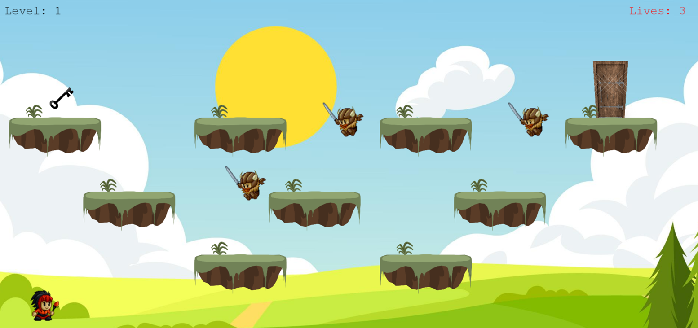
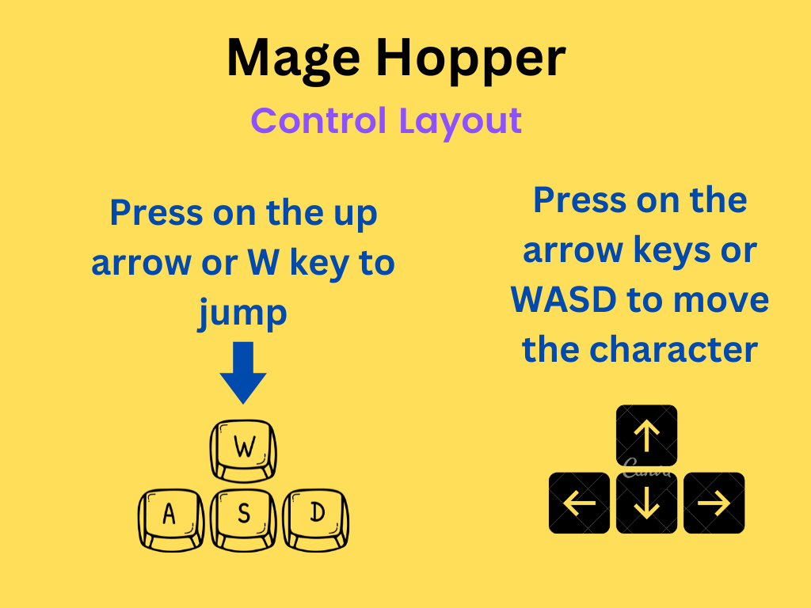
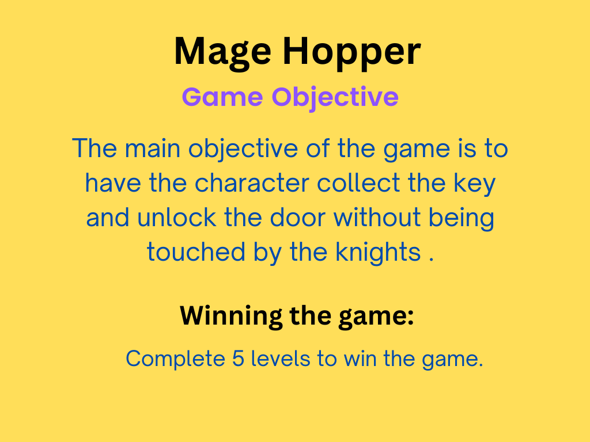

# Mage Hopper

Mage Hopper is an exciting platformer game where you navigate through levels, collect keys, and avoid enemies to progress.

## Instructions

1. **Start Game**: Click on "Start Game" to begin playing.
2. **Controls**:
   - Move Left: `Left Arrow Key` or `A`
   - Move Right: `Right Arrow Key` or `D`
   - Jump: `Up Arrow Key` or `W`
3. **Collect Keys**: Collect keys to unlock the door and progress to the next level.
4. **Avoid Enemies**: Watch out for enemies. Touching them will cost you a life.
5. **Game Over**: Lose all your lives and it's game over. You can choose to play again or quit.
6. **Level Win**: Reach the door with the key to advance to the next level.
7. **Game Win**: Complete all levels to win the game!

## Screenshots

## GamePlay

## Preview Instructions

## Credits

- Created by Richard Schleckser
