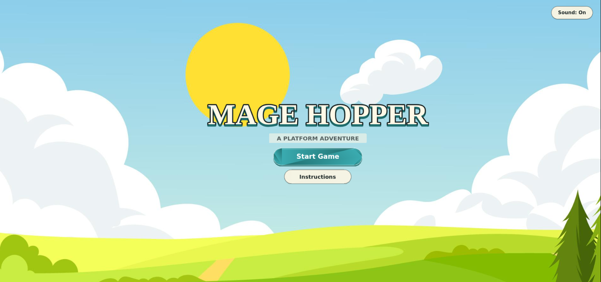
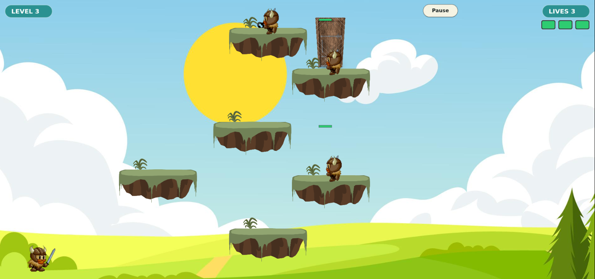
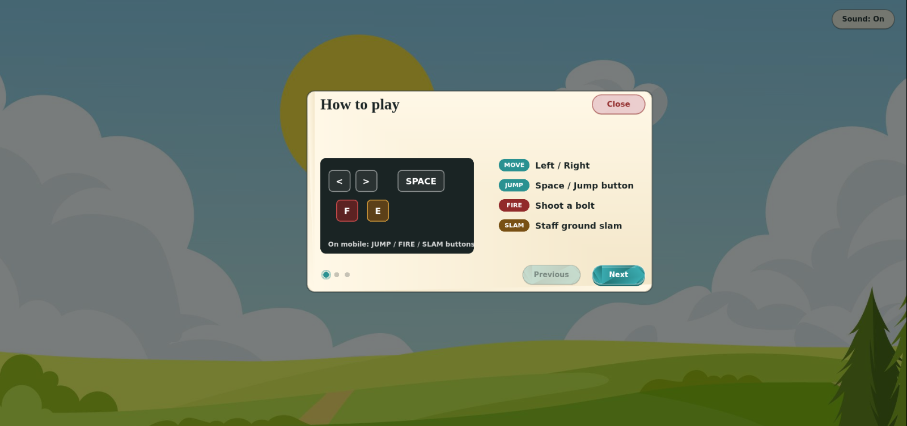
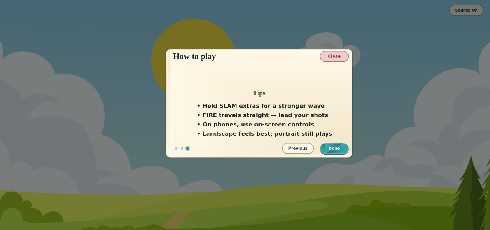

# Mage Hopper

Mage Hopper is a platformer where you hop across floating platforms as a fire mage, blast knights with FIRE bolts and staff SLAM waves, collect the key on each stage, and reach the door before you run out of lives. Clear all 5 levels to win. Playable on desktop and mobile.

**Play the game [here](https://rschleckser.github.io/mage-hopper/)**

## Instructions

1. **Start Game**: Click "Start Game" on the main menu to begin, or "Instructions" for an in-game walkthrough of controls, objective, and tips.
2. **Controls**:
   - Move Left: `Left Arrow` or `A`
   - Move Right: `Right Arrow` or `D`
   - Jump: `Up Arrow` or `W`
   - Fire: `F` — shoots a bolt straight ahead
   - Slam: `E` — a stronger staff-swing wave attack
   - On mobile/touch devices, on-screen JUMP / FIRE / SLAM buttons and a directional pad appear automatically.
3. **Defeat Enemies**: Knights patrol the platforms and chase you — take them out with FIRE or SLAM before they touch you.
4. **Collect the Key**: Find the key on each level, then reach the door to advance.
5. **Avoid Damage**: Getting touched by an enemy costs a life (3 lives per run, with a brief invulnerability window after each hit).
6. **Game Over**: Lose all your lives and it's game over — play again or return to the menu.
7. **Level Win**: Reach the door with the key to advance to the next level (5 levels total).
8. **Game Win**: Clear all 5 levels to win the game!

## Screenshots

### Main Menu



### Gameplay



### In-Game Instructions





## Technologies Used

- HTML5 / CSS3
- JavaScript (ES Modules — no build step or bundler required)
- [Phaser 3](https://phaser.io/) game framework

## Project Structure

The game logic lives under `src/`, organized by responsibility:

```
src/
  entities/       Projectile and slam-wave sprite classes + pools
  ui/             Reusable pill-button UI kit and DOM overlay helpers
  scenes/         Menu, Game Over, Level Win, Game Win scenes
  scenes/game-scene/  Animations, player state machine, enemy AI, combat
  levels.js       Per-level key/door spawn points and platform layout
  game-state.js   Shared run state (lives, level, key collected)
  constants.js    Gameplay tuning values (speeds, hitboxes, etc.)
  input.js        Touch/mobile control handling
  main.js         Phaser config and game bootstrap
```

`index.html` loads `src/main.js` directly as an ES module — just open it through a local static server (no `npm install` or build required).

## Credits

- Created by Richard Schleckser


