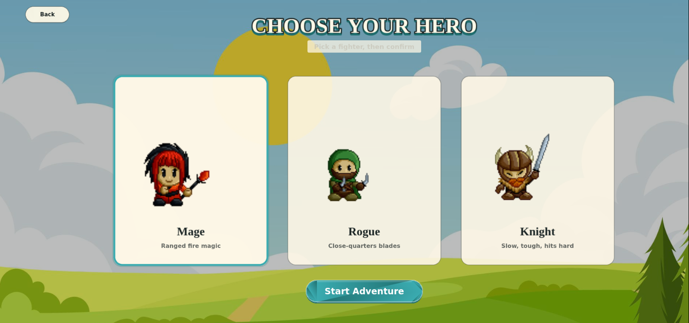

# Mage Hopper

Browser platformer built with [Phaser 3](https://phaser.io/). Pick a hero, clear 5 hand-built levels, collect the key, reach the door.

**[Play it](https://rschleckser.github.io/mage-hopper/)** · desktop and mobile.

I built the playable MVP by hand — movement, combat, levels, scenes — then used Claude on a branch to help refactor toward per-character/per-level modules, a mobile-first UI, and sound. The game loop and level design are mine; AI was used for structure and polish, reviewed and re-tuned before anything merged.


## Features

- **3 heroes, different combat feel**: **Mage** (ranged fire, fragile), **Rogue** (fast melee), **Knight** (slow tank, extra HP/lives)
- **5 levels**; later stages add oscillating and conveyor-belt moving platforms on top of standard jump-and-climb layouts
- **HP per life + lives**, both sides. Contact alone doesn't hurt you — only a landed enemy attack does, then a brief invulnerability window
- **Mobile-first UI**: menu, character select, pause, and end screens are real full-viewport layouts on phones, not a shrunk-down desktop canvas

## Controls

| Action | Keyboard | Touch |
| --- | --- | --- |
| Move | `←`/`→` or `A`/`D` | D-pad |
| Jump | `↑` or `W` | JUMP |
| Attack | `F` | FIRE |
| Extra Attack | `E` | SLAM |
| Pause | `P` or `Esc` | Pause |

Touch controls appear automatically on phones and tablets.

## Screenshots

<p>
  
  
</p>

## Stack

HTML/CSS, JavaScript ES modules, Phaser 3.80.0 via CDN. No bundler, no `npm install`.

## How it's put together

```
src/
  main.js               Phaser bootstrap
  characters.js         Stats, anims, assets per hero
  game-state.js         Lives, HP, level, key
  levels.js             Platforms, movers, key/door
  entities/             Projectile + slam-wave pools
  scenes/game-scene/    Player state machine, enemy AI, combat, HUD
  ui/                   Mobile DOM overlays (sit on top of the canvas)
```

Design choices worth asking about:

- **No build step** — ES modules served straight from a static host (GitHub Pages). Tradeoff: no bundling/tree-shaking; gain: one folder, one server command.
- **Mobile UI is DOM, not Phaser canvas text** — Phaser's Scale.FIT letterboxes the canvas down to a thin strip on narrow/portrait phones, which shrank canvas-drawn buttons and text to the point of being unusable. `shouldUseDomOverlay()` swaps the menu, character select, pause, and end screens to full-viewport DOM overlays instead of scaling the desktop layout down.
- **Object pools** for fire bolts and slam waves (`entities/`) so attacking doesn't allocate a new sprite every shot.
- **Shared `game-state`** so lives/HP/level survive scene swaps (menu → character select → game → level-win → next level).
- **Debug overlay**: press `` ` `` in-game for player/enemy speed readouts and Arcade Physics collision boxes.

## AI workflow

1. Hand-built the MVP first — player movement, combat, and the original levels — until the game was playable start to finish.
2. Used Claude on a feature branch to split the monolithic scene code into per-character/per-level modules, build the mobile DOM UI, and add sound.
3. Reviewed and re-tuned before merging. Concrete example: an early refactor replaced how losing a life *looked* — Claude changed all damage reactions to an in-place hurt animation, including life loss, which used to teleport the player to a random spot and fade back in. Playing it, the life-loss case had lost its impact. I pointed at the exact prior commit and line with the original respawn code and had it restored for that case specifically, keeping the new in-place reaction for ordinary HP chip damage ([`5b0b362`](https://github.com/rSchleckser/mage-hopper/commit/5b0b3622b363bdbc06a906b7705734cffbba4a46)).
4. I still own level layout and combat feel — where a refactor changed jump timing, hit ranges, or damage feedback, I played it and put back what didn't feel right.

## Run locally

ES modules need a real HTTP origin, not `file://`:

```bash
python3 -m http.server 8000
# http://localhost:8000
```

## Status

Playable end-to-end on desktop and phone: 5 levels, 3 heroes, mute, pause, and win/lose flows all work.

**Known limitations:**
- Enemy AI is one generic chase/attack behavior reused across every level — level design varies platform layout and enemy *placement*, not enemy *behavior*.
- Mobile menu sizing is sensitive to the browser's own chrome (address bar show/hide) on some devices.
- Double jump is fully implemented but gated behind an unlock flag, off by default, while I decide how to surface it as a real unlockable instead of just shipping it live.
- The in-game Instructions overlay has a couple of stale spots: it shows a "SPACE" hint for Jump (actually bound to Up/W only), and its wording is Mage-flavored ("FIRE or SLAM") even though Rogue and Knight fight melee.

## Credits

- **Code**: Richard Schleckser
- **Character sprites** (Mage, Rogue, Knight): [Assassin, Mage, Viking - Free Pixel Art Game Heroes](https://craftpix.net/freebies/assassin-mage-viking-free-pixel-art-game-heroes/) by CraftPix
- **Background artwork**: [Freepik](https://www.freepik.com/) (Freepik Company S.L.)
- **Sound effects**: rendered with [sfxr.me](https://sfxr.me/) (public domain / Unlicense)

Code is [MIT](./LICENSE). Art and audio keep their own listed sources/licenses.
